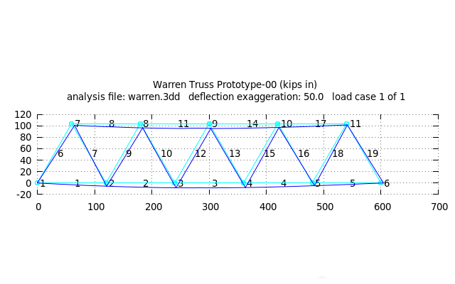

# Bridge Simulation
_A qucik explanation of the simulator input file._

I have created a simple 2D model of a Warren Truss bridge for [Frame3DD](http://frame3dd.sourceforge.net/) (open-source multiplatform truss simulation software).

The input file that defines the truss can be found [here](warren.3dd), explanation of the format is available in the [documentation](http://svn.code.sourceforge.net/p/frame3dd/code/trunk/doc/Frame3DD-manual.html#inputdata). The units and material properties are still incorrect, but the loading distribution works. 

The results of the analysis can be found in the [.out](warren.out) file, the GNU Plot file showing the bridge under load is [here](warren.plt). Compiled plot looks like this:

